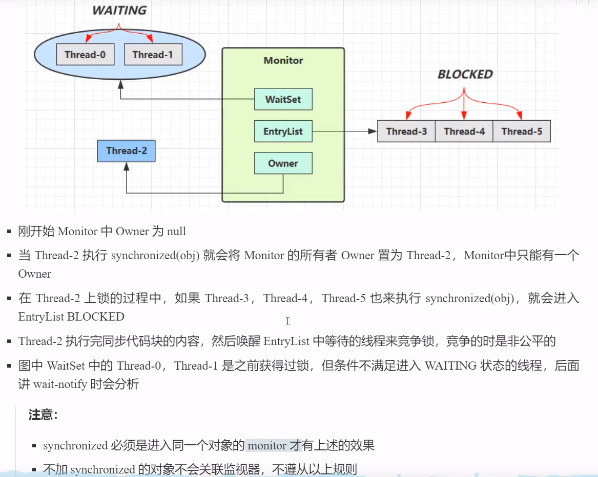
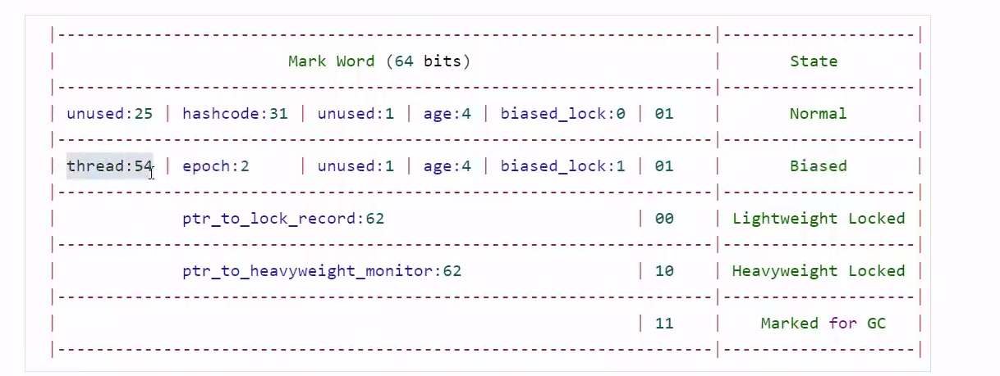
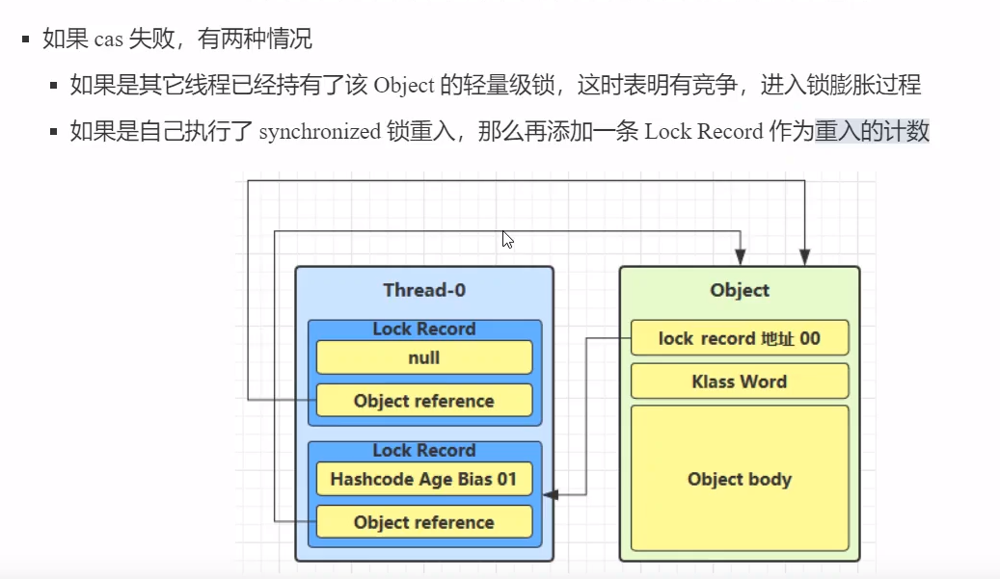

##  JVM学习笔记

### 一、线程

#### 1.1 start()/run()

#### 1.2 sleep()/ wait()/yield()/join()

#### 1.3 isInterrupted()/interrupted()

+ 打断 sleep(),wait(),join()的线程

  抛出InterruptedExecption,清空标志位。

+ 打断正常运行的线程

  继续运行，标记为置为true.

+ interrupted()调用后，会把标志位清除。(第二次调用的时候就是返回`false`)

#### 1.4 终止线程

1. **stop()---不推荐使用**

   > 如果当前线程没有释放锁，那么会**浪费锁资源**。

2. **System.exit(0);**

   > 停止整个进程。

3. **不推荐使用的方式**

   stop()/suspend()/resume()

   建议使用： interrupt()/wait()/notify()

#### 1.5 守护线程

当没有非守护线程存在的时候，则虚拟机会退出。

应用场景

+ 垃圾回收线程
+ Tomcat中的接受请求和分发请求的线程。

#### 1.6 线程的状态

从操作系统的角度来讲，只有五种。

**new  > Runnable/Running > wait > Blocked**

```java
public Enum State{
    NEW,
    RUNNABLE,
    BLOCKED,
    WAIT,
    TIMED_WAITING,
    TERMINATED;
}
```

### 二、共享模型

问题都是发生在对于共享资源 `临界区` 的修改。

解决方案：

#### 2.1 synchronized（互斥）

> **同一个时刻，只有一个线程能够获取对象锁 `monitor`。**

##### 2.1.1 使用方式

+ 加在方法上（成员方法、静态方法）
+ 代码块

##### 2.2.2 Monitor




##### 2.2.3 锁膨胀



+ **偏向锁**

  无锁和偏向锁的state都是`01`,但是 偏向锁`biased_lock=1`

  1. 默认是开启偏向锁的，那么创建对象的时候，markword的后三位是`101`；

  2. 偏向锁是**默认延迟**的，不会在立即生效；

  只有第一次的时候，会使用`CAS` 将 `ThreadId` 替换`markword`.

```java
Object obj = new Object();
// 会禁用掉偏向锁，直接变成无锁状态
obg.hashcode(); 
synchronized(obj){
    //dosomething
}
```

**什么时候升级为轻量级锁、重量级锁？**

遇到其他线程获取同一把锁的时候，则会发生锁升级；

只有重量级锁可以调用wait、notify()；

+ **批量重偏向** 【这里指的是锁释放以后的状态】

  当撤销偏向锁的次数超过20次，则会批量重偏向到加锁线程。

  当jvm撤销偏向锁的次数超过40次，则会**撤销偏向锁**。

+ **轻量级锁**

  

+ **重量级锁**

使用CAS更新mark Word失败，则会为Object对象申请monitor锁，使锁的标记为`10`.


##### 2.2.4 自适应自旋

> JDK1.6以后可以使用自适应自选。
>
> 单核`CPU`自选就是浪费时间，多核`cpu` 自旋才有用。

**如果自旋失败，则进入_entryList**

**局部变量是保存在自己线程的栈帧中，不会共享，不存在线程安全的问题。**

#### 2.2 Lock

#### 2.3 线程安全的类

+ String/Integer(包装类)
+ StrignBuffer
+ Random
+ vector
+ HashTable
+ juc下的类

```java
//
Hashtable table = new Hashtable(); 
if( table.get("key") == null) {    
    table.put("key", value); 
}
```


> 开闭原则。final、private就是属于closed,避免子类修改。可以实现线程安全